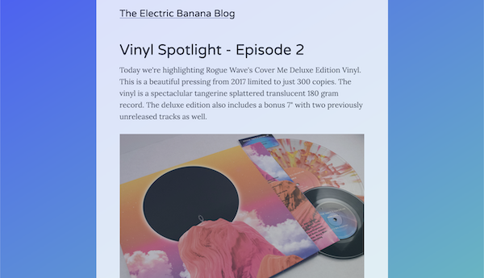

# React Music Blog

## Preview

## Demo
A live demo is currently unavailable but in progress. GitHub pages is meant for static pages and this blog dynamically renders the markdown files into HTML documents, causing an issue when accessing the blog posts.

## Description
A responsive music blog application built with React, Gatsby, Node, and Emotion-JS. Completed for an 8 hour rapid development cycle project in the CSCI-495 IS Capstone course at Coastal Carolina University.

## Dependencies
<ul>
  <li>Emotion</li>
  <li>Gatsby</li>
  <li>React</li>
  <li>Typography</li>
  <li>Node</li>
</ul>

## Usage
<ul>
  <li>Ensure you have node.js installed & up to date</li>
  <li>Install Gatsby ('npm install -g gatsby-cli')</li>
  <li>Download the repo ('gatsby new music-blog https://github.com/skyreep/music-blog.git')</li>
  <li>Navigate into the repo ('cd music-blog')</li>
  <li>Start the Gatsby development server ('gatsby develop')</li>
  <li>Navigate to the live development site (http://localhost:8000/)</li>
</ul>

## Future Work
I would like to improve the UI significantly, and debug the github pages live demo. I would also like to add some social media icons/links for readers to connect with the curator easily. 
 
